# X32 Tools - Rust Rewrite

This project is a complete rewrite of the X32 command-line tools in Rust, focusing on simplicity, stability, and reliability. The goal is to provide a modern, high-quality, and easy-to-maintain suite of tools for controlling Behringer X32 and Midas M32 digital mixers.

## Table of Contents

- [Credits](#credits)
- [License](#license)
- [Architecture](#architecture)
- [Workspace Crates](#workspace-crates)
- [Building the Tools](#building-the-tools)
- [Running the Tools](#running-the-tools)

## Credits

This project is a fork and rewrite of the original X32 libraries.

*   **Original concept and work on the C library:** Patrick-Gilles Maillot ([https://sites.google.com/site/patrickmaillot/x32](https://sites.google.com/site/patrickmaillot/x32))
*   **Additional concepts by:** [User]
*   **Rust implementation by:** [User]

## License

This Rust rewrite is licensed under the **GNU General Public License v3.0**. A full copy of the license is available in the `LICENSE` file in this directory.

## Architecture

The project is structured as a Cargo workspace with three core library crates and a collection of binary crates that provide the command-line tools.

```mermaid
graph TD;
    subgraph Libraries
        osc_lib;
        x32_lib;
        x32_core;
    end

    subgraph Binaries
        x32_autobeat;
        x32_automix;
        x32_commander;
        x32_copy_fx;
        x32_custom_layer;
        x32_desk_restore;
        x32_desk_save;
        x32_emulator;
        x32_fade;
        x32_geq2_cpy;
        x32_get_lib;
        x32_get_scene;
        x32_get_scene_name;
        x32_reaper;
        x32_replay;
        x32_set_lib;
        x32_set_preset;
        x32_set_scene;
        x32_tap;
        x32_tcp;
        x32_usb;
        x32_wav_xlive;
    end

    x32_lib --> osc_lib;
    x32_core --> osc_lib;
    x32_emulator --> x32_core;
    x32_emulator --> x32_lib;

    x32_automix --> x32_lib;
    x32_autobeat --> x32_lib;
    x32_commander --> x32_lib;
    x32_copy_fx --> x32_lib;
    x32_custom_layer --> x32_lib;
    x32_desk_restore --> x32_lib;
    x32_desk_save --> x32_lib;
    x32_fade --> x32_lib;
    x32_geq2_cpy --> x32_lib;
    x32_get_lib --> x32_lib;
    x32_get_scene --> x32_lib;
    x32_get_scene_name --> x32_lib;
    x32_reaper --> x32_lib;
    x32_replay --> x32_lib;
    x32_set_lib --> x32_lib;
    x32_set_preset --> x32_lib;
    x32_set_scene --> x32_lib;
    x32_tap --> x32_lib;
    x32_tcp --> x32_lib;
    x32_usb --> x32_lib;

    x32_automix --> osc_lib;
    x32_autobeat --> osc_lib;
    x32_commander --> osc_lib;
    x32_copy_fx --> osc_lib;
    x32_custom_layer --> osc_lib;
    x32_desk_restore --> osc_lib;
    x32_desk_save --> osc_lib;
    x32_emulator --> osc_lib;
    x32_fade --> osc_lib;
    x32_geq2_cpy --> osc_lib;
    x32_get_lib --> osc_lib;
    x32_get_scene --> osc_lib;
    x32_get_scene_name --> osc_lib;
    x32_reaper --> osc_lib;
    x32_replay --> osc_lib;
    x32_set_lib --> osc_lib;
    x32_set_preset --> osc_lib;
    x32_set_scene --> osc_lib;
    x32_tap --> osc_lib;
    x32_tcp --> osc_lib;
    x32_usb --> osc_lib;
```



## Workspace Crates

### Library Crates

| Crate       | Description                                                                                             |
| ----------- | ------------------------------------------------------------------------------------------------------- |
| `osc_lib`   | A foundational library for encoding and decoding Open Sound Control (OSC) messages.                   |
| `x32_lib`   | The primary library for generating and parsing X32-specific OSC commands.                               |
| `x32_core`  | The core logic for the X32 emulator, which simulates the behavior of a real mixer.                      |

### Binary Crates

| Crate                | Description                                                                                             |
| -------------------- | ------------------------------------------------------------------------------------------------------- |
| `x32_autobeat`       | Automatic beat detection and synchronization tool.                                                      |
| `x32_automix`        | Provides automixing functionality by monitoring channel levels and adjusting faders.                      |
| `x32_commander`      | A bridge that triggers OSC or MIDI commands in response to incoming OSC messages.                         |
| `x32_copy_fx`        | A utility for copying and resetting FX parameters.                                                      |
| `x32_custom_layer`   | A tool for creating, saving, and restoring custom channel layers.                                         |
| `x32_desk_restore`   | Restores the mixer's state from a file containing OSC commands.                                           |
| `x32_desk_save`      | Saves the mixer's state (scene, routing, etc.) to a file.                                                 |
| `x32_emulator`       | A command-line utility that simulates an X32 console for offline testing and development.                 |
| `x32_fade`           | A tool for creating smooth, timed fader transitions.                                                    |
| `x32_geq2_cpy`       | A utility for copying and resetting Graphic EQ (GEQ) settings.                                            |
| `x32_get_lib`        | Retrieves library presets from the mixer.                                                               |
| `x32_get_scene`      | Retrieves scene data from the mixer.                                                                    |
| `x32_get_scene_name` | Retrieves the name of the currently active scene.                                                       |
| `x32_reaper`         | A bridge between X32 and Reaper DAW.                                                                    |
| `x32_replay`         | Replays a recorded session of OSC commands.                                                             |
| `x32_set_lib`        | Sends library presets to the mixer.                                                                     |
| `x32_set_preset`     | Loads a preset on the mixer.                                                                            |
| `x32_set_scene`      | Sends a series of OSC commands from standard input to the mixer.                                          |
| `x32_tap`            | A tool for setting FX delay times by tapping.                                                           |
| `x32_tcp`            | A TCP to UDP bridge for sending OSC commands to the mixer over a text-based TCP connection.               |
| `x32_usb`            | A shell-like interface for managing a USB drive connected to the console.                                 |
| `x32_wav_xlive`      | A utility for merging multiple mono WAV files into a multi-channel X-Live! session.                       |

For more detailed information on each tool, please refer to the `README.md` file in the respective crate's directory.

## Building the Tools

This project is structured as a Rust workspace. To build all the tools, you will need to have a recent version of the Rust toolchain installed.

1.  **Clone the repository.**
2.  **Navigate to the root of the repository.**
3.  **Build the entire workspace:**

    ```bash
    cargo build --release
    ```

The compiled binaries will be located in the `target/release/` directory.

## Running the Tools

Once built, you can run any of the tools from the `target/release/` directory. For example, to run `x32_get_scene_name`:

```bash
./target/release/x32_get_scene_name --ip 192.168.1.64
```
