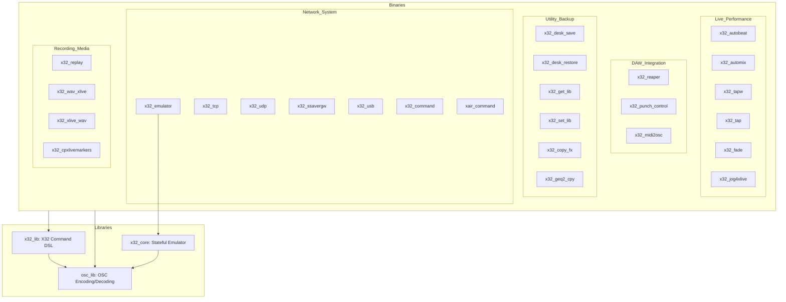

# X32 Tools - Rust Rewrite

This project is a high-performance, secure rewrite of the X32 command-line tools in Rust. It provides a comprehensive suite of utilities for controlling, automating, and extending the capabilities of Behringer X32 and Midas M32 digital mixers.

## 🚀 Key Features

*   **⚡ Bolt Optimized:** High-frequency serialization paths have been hand-optimized to eliminate unnecessary allocations and macro overhead, ensuring minimal latency in live audio environments.
*   **🛡️ Sentinel Hardened:** Built with safety in mind. All file and network inputs are bounded to prevent memory exhaustion (OOM) and Denial-of-Service attacks.
*   **🧩 Modular Architecture:** A collection of 30+ specialized tools built on a shared, stateful emulator and OSC library.
*   **🎹 Creative Extensions:** Includes advanced tools like `x32_autobeat` for BPM-syncing effects and `x32_tapw` for interactive TUI-based tempo control.

---

## 🗺️ Project Architecture

The project is structured as a Cargo workspace with three core library crates and a collection of binary crates providing specialized CLI tools.


```mermaid
graph TD;
    subgraph Libraries
        osc_lib[osc_lib: OSC Encoding/Decoding];
        x32_lib[x32_lib: X32 Command DSL];
        x32_core[x32_core: Stateful Emulator];
    end

    subgraph Binaries
        direction TB
        subgraph Live_Performance
            x32_autobeat; x32_automix; x32_tapw; x32_tap; x32_fade; x32_jog4xlive;
        end
        subgraph DAW_Integration
            x32_reaper; x32_punch_control; x32_midi2osc;
        end
        subgraph Utility_Backup
            x32_desk_save; x32_desk_restore; x32_get_lib; x32_set_lib; x32_copy_fx; x32_geq2_cpy;
        end
        subgraph Network_System
            x32_emulator; x32_tcp; x32_udp; x32_ssavergw; x32_usb; x32_command; xair_command;
        end
        subgraph Recording_Media
            x32_replay; x32_wav_xlive; x32_xlive_wav; x32_cpxlivemarkers;
        end
    end

    x32_lib --> osc_lib;
    x32_core --> osc_lib;
    x32_emulator --> x32_core;

    Binaries --> x32_lib;
    Binaries --> osc_lib;
```

---

## 🧩 Workspace Crates

### Core Libraries
| Crate | Description |
| :--- | :--- |
| `osc_lib` | Foundational library for high-speed OSC message processing. |
| `x32_lib` | The primary DSL for generating and parsing X32-specific OSC commands and parameter scaling. |
| `x32_core` | Core emulator logic with support for `/xremote` client tracking and state broadcasting. |

### Featured Tools
| Crate | Category | Description |
| :--- | :--- | :--- |
| `x32_autobeat` | **Live** | Automatic BPM detection (Energy/Spectral) and effect synchronization. |
| `x32_tapw` | **Live** | Interactive TUI for setting delay tap tempo with auto-thresholding. |
| `x32_reaper` | **Studio** | Bidirectional bridge between X32 and Reaper DAW (Faders, Mutes, Pans). |
| `x32_punch_control`| **Studio** | MIDI-sync'd automation recording/playback via `.xpc` format. |
| `x32_emulator` | **System** | Full-featured console simulator for offline development and testing. |

> [!TIP]
> See the [Full Crate Index](docs/USER_GUIDE.md#crate-index) in the User Guide for the complete list of 30+ tools.

---

## 🛠️ Getting Started

### Prerequisites
*   [Rust toolchain](https://rustup.rs/) (latest stable)
*   Network access to an X32/M32 console (or run `x32_emulator` locally).

### Building
```bash
cargo build --release
```
Compiled binaries are located in `target/release/`.

### Quick Start: Emulator & Command
1. Start the emulator: `./target/release/x32_emulator`
2. Send a command: `./target/release/x32_command --ip 127.0.0.1 "/ch/01/mix/fader 0.75"`

---

## 📖 Documentation Layers

1.  **Discovery (This File):** Quick overview and project structure.
2.  **Conceptual Map ([User Guide](docs/USER_GUIDE.md) / [Architecture](docs/ARCHITECTURE.md)):** Workflow-based instructions and system design.
3.  **Deep Reference:** Individual `README.md` files in each crate folder and [Rustdoc](https://docs.rs) (run `cargo doc --open`).

---

## 📜 Credits & License

*   **Original C Libraries:** Patrick-Gilles Maillot ([Patrick Maillot's X32 Site](https://sites.google.com/site/patrickmaillot/x32))
*   **Rust Rewrite:** Google Jules & Gemini CLI.
*   **License:** GNU General Public License v3.0 (See [LICENSE](LICENSE)).
